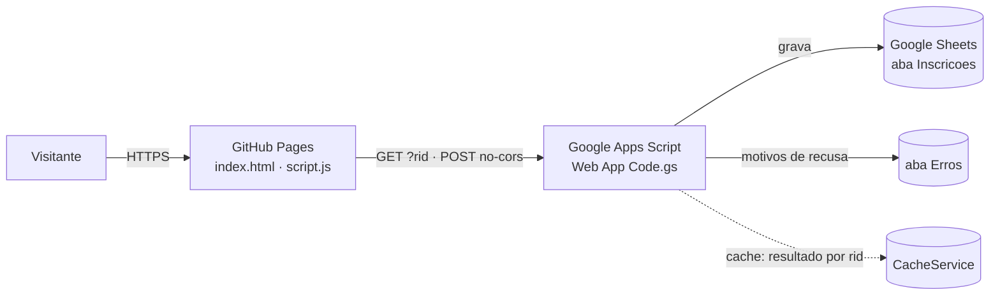

# 🐍 Python Floripa — Inscrição de Voluntários

Site de inscrição para o programa de voluntariado da comunidade **Python Floripa** (Florianópolis/SC). Página estática com formulário validado, recebimento via Google Apps Script e armazenamento em Google Sheets. Sem build, sem servidor próprio, sem cookies.

[](https://labarboza14.github.io/python-floripa-voluntariado/)


**Site:** https://labarboza14.github.io/python-floripa-voluntariado/ · **Documentação técnica:** [`docs/DOCUMENTACAO_TECNICA.md`](docs/DOCUMENTACAO_TECNICA.md)

## Sumário
- [Funcionalidades](#funcionalidades)
- [Arquitetura em resumo](#arquitetura-em-resumo)
- [Estrutura do repositório](#estrutura-do-repositório)
- [Início rápido](#início-rápido)
- [Configuração](#configuração)
- [Publicação (deploy)](#publicação-deploy)
- [Testes](#testes)
- [Segurança e privacidade](#segurança-e-privacidade)
- [Solução de problemas](#solução-de-problemas)
- [Manutenção e contribuição](#manutenção-e-contribuição)

## Funcionalidades
| Área | O que entrega |
|---|---|
| **Formulário** | Validação em tempo real, máscara de WhatsApp, contador de caracteres, rascunho automático na aba, mensagens de erro por campo |
| **Confirmação real** | O site só exibe "Inscrição recebida!" depois que o servidor confirma a gravação (nunca "falso sucesso") |
| **Resiliência** | Reenvio seguro (sem duplicar), erro claro se o serviço estiver fora do ar, dados preservados na tela |
| **Segurança** | Validação dupla (navegador + servidor), anti-bot, limite de envios, proteção contra injeção de fórmulas na planilha, CSP restritiva |
| **LGPD** | Consentimento explícito, [política de privacidade](privacidade.html), sem cookies nem rastreadores |
| **Acessibilidade e responsividade** | Foco visível, `fieldset`/`legend`, `aria-live`, layout fluido para celular, respeita `prefers-reduced-motion` |

## Arquitetura em resumo

Fluxo detalhado, contrato da API e decisões de projeto em [`docs/DOCUMENTACAO_TECNICA.md`](docs/DOCUMENTACAO_TECNICA.md).

## Estrutura do repositório
```
├── index.html           Página e formulário (CSP via <meta>)
├── styles.css           Estilos (tema escuro, responsivo)
├── script.js            Validação, envio e confirmação (CONFIG no topo)
├── privacidade.html     Política de Privacidade (LGPD)
├── Code.gs              Apps Script — NÃO roda no site; é colado no projeto do Google
├── tests/run.js         Suíte automatizada (44 testes)
├── docs/
│   └── DOCUMENTACAO_TECNICA.md
├── CHANGELOG.md
├── package.json         Só scripts de teste/servidor local
└── .gitignore
```

## Início rápido
**Pré-requisitos:** Python 3 (servidor local) e Node.js 18+ (apenas para os testes).
```bash
git clone https://github.com/labarboza14/python-floripa-voluntariado.git
cd python-floripa-voluntariado
python3 -m http.server 8000     # http://localhost:8000
```
> Em ambiente local o envio funciona de verdade: o formulário grava na planilha de produção. Para testar sem gravar, aponte `SCRIPT_URL` para uma implantação e uma planilha de teste.

## Configuração
| Onde | Parâmetro | Função |
|---|---|---|
| `script.js` → `CONFIG.SCRIPT_URL` | URL `/exec` do Web App | Destino do formulário |
| `script.js` → `CONFIG.MIN_SECONDS` | `3` | Tempo mínimo antes do envio (anti-bot) |
| `script.js` → `CONFIG.CONFIRM_TRIES` | `12` | Consultas de confirmação (1 por segundo) |
| `Code.gs` → `CFG.SHEET_ID` / `CFG.ABA` | ID da planilha / `Inscricoes` | Onde gravar |
| `Code.gs` → `CFG.MAX_POR_MINUTO` | `30` | Limite global de envios por minuto |
| `Code.gs` → `CFG.TRILHAS`, `CFG.DISPONIBILIDADES` | listas | Valores aceitos (devem espelhar o `index.html`) |

## Publicação (deploy)
1. **Apps Script:** colar `Code.gs`, salvar e rodar `testarGravacao` uma vez (autoriza o script).
2. **Implantar → Gerenciar implantações → ✏️:** *Executar como* **Eu** · *Quem pode acessar* **Qualquer pessoa** · *Versão* **Nova versão**.
3. **Verificar em janela anônima:** a URL `/exec` deve mostrar `{"result":"ok","versao":"…","aba_ok":true}`. Tela de login = acesso errado.
4. **Site:** conferir `SCRIPT_URL`, fazer commit na `main` (o GitHub Pages publica em 1–2 min; Ctrl+F5 para limpar cache).
5. **Teste real:** enviar uma inscrição com e-mail novo, conferir a linha na planilha e apagá-la.

> Ao editar `Code.gs`, use sempre **✏️ → Nova versão** na implantação existente: a URL não muda. "Nova implantação" cria URL nova.

## Testes
```bash
npm install      # instala jsdom (devDependency)
npm test         # 44 testes: front-end + Code.gs
```
Cobrem validação, máscara, confirmação, falha de rede, serviço bloqueado por login, idempotência, injeção de fórmula, honeypot, limite de envios e regras de CSP. **Não substituem** o teste real após cada deploy (passo 5).

## Segurança e privacidade
- Dados pessoais trafegam só no corpo do POST (nunca em URL) e ficam em planilha com acesso restrito aos organizadores.
- CSP sem `unsafe-inline`; `connect-src` limitado ao Google; sem fontes, CDNs ou scripts de terceiros.
- Detalhes, modelo de ameaças e limites conhecidos: [Segurança](docs/DOCUMENTACAO_TECNICA.md#7-segurança-e-privacidade).
- Para reportar uma vulnerabilidade, use o contato de privacidade descrito em [`privacidade.html`](privacidade.html) — não abra issue pública com dados pessoais.

## Solução de problemas
| Sintoma | Causa provável | Ação |
|---|---|---|
| "Não conseguimos confirmar o envio" + `Failed to fetch` no Console | `/exec` exige login (acesso errado) | Reimplantar com **Qualquer pessoa** (passo 2) |
| `/exec` mostra `versao` antiga | Faltou **Nova versão** | Reimplantar |
| `/exec` retorna 404 | ID inexistente/arquivado | Copiar a URL pelo botão **Copiar** em *Gerenciar implantações* |
| "O servidor não aceitou o campo X" | Valor fora da regra do servidor | Ver aba `Erros` e [tabela de erros](docs/DOCUMENTACAO_TECNICA.md#64-códigos-de-erro) |
| Site com visual/lógica antigos | Cache | Ctrl+F5 ou incrementar `?v=` nos links |

Guia completo: [Troubleshooting](docs/DOCUMENTACAO_TECNICA.md#11-troubleshooting).

## Manutenção e contribuição
1. Crie um branch, altere, rode `npm test`.
2. Mudou `Code.gs`? Cole no Apps Script e publique **Nova versão** (e atualize `VERSAO` e o [CHANGELOG](CHANGELOG.md)).
3. Mudou assets? Incremente o `?v=` em `index.html` e `privacidade.html`.
4. Abra um Pull Request descrevendo o que mudou e como foi testado.

**Licença:** a definir pela organização (adicione um arquivo `LICENSE` antes de aceitar contribuições externas).
