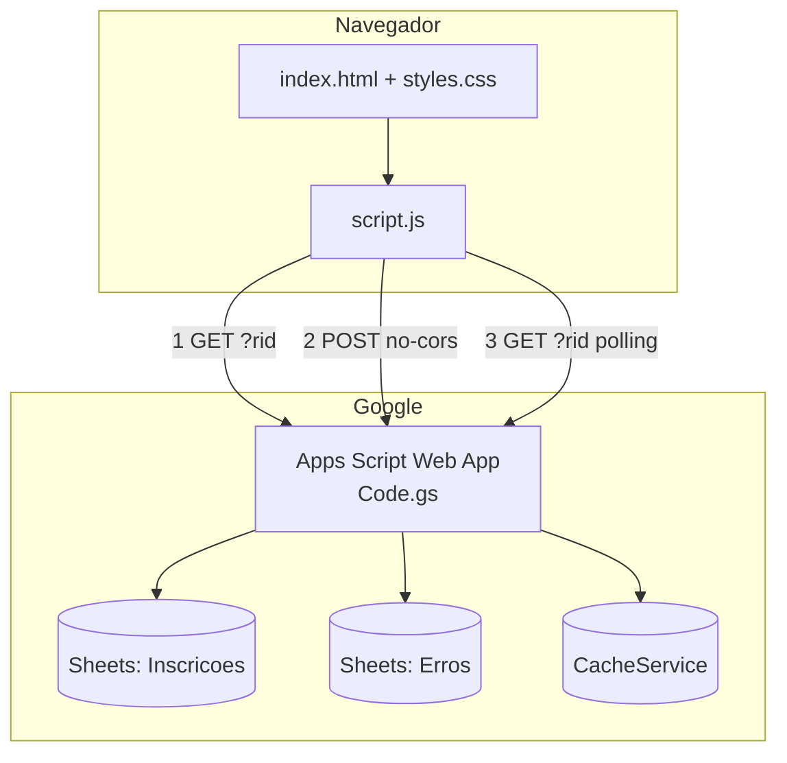
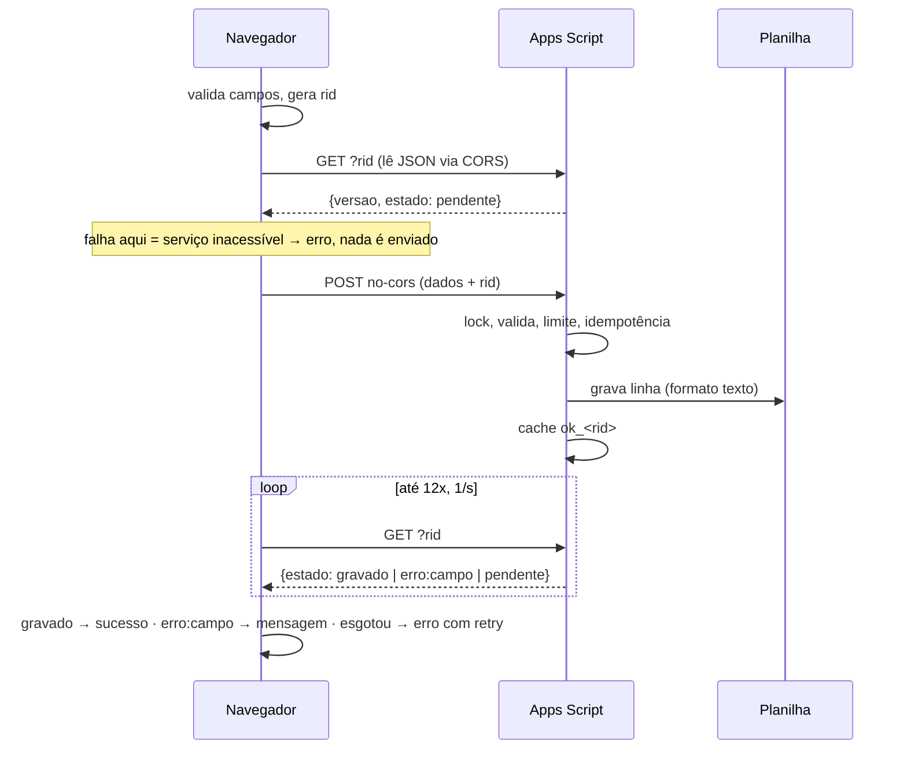

# Documentação Técnica — Inscrição de Voluntários Python Floripa

| | |
|---|---|
| **Versão do documento** | 1.0.0 (02/10/2026) |
| **Versão do servidor (`Code.gs`)** | `2026-10-01.6` |
| **Repositório** | https://github.com/labarboza14/python-floripa-voluntariado |
| **Site** | https://labarboza14.github.io/python-floripa-voluntariado/ |
| **Público-alvo** | Quem mantém, audita ou evolui o projeto |

## Índice
1. [Visão geral](#1-visão-geral) · 2. [Arquitetura](#2-arquitetura) · 3. [Estrutura do repositório](#3-estrutura-do-repositório) · 4. [Requisitos e ambientes](#4-requisitos-e-ambientes) · 5. [Front-end](#5-front-end) · 6. [Back-end (Apps Script)](#6-back-end-apps-script) · 7. [Segurança e privacidade](#7-segurança-e-privacidade) · 8. [Deploy e runbook](#8-deploy-e-runbook) · 9. [Operação e monitoramento](#9-operação-e-monitoramento) · 10. [Testes](#10-testes) · 11. [Troubleshooting](#11-troubleshooting) · 12. [Decisões de arquitetura](#12-decisões-de-arquitetura) · 13. [Limitações e roadmap](#13-limitações-e-roadmap) · 14. [Histórico](#14-histórico-do-projeto) · 15. [Glossário](#15-glossário)

---

## 1. Visão geral
**Objetivo.** Receber inscrições de voluntários da comunidade Python Floripa, com validação, consentimento LGPD e confirmação confiável de gravação.

**Escopo.** Landing page + formulário → Apps Script → planilha. Fora do escopo: login, painel administrativo, e-mails automáticos, banco de dados.

**Requisitos não funcionais atendidos**
| Requisito | Como é atendido |
|---|---|
| Custo zero / sem servidor | GitHub Pages + Apps Script + Sheets (camadas gratuitas) |
| Confiabilidade | Confirmação por `rid`, reenvio idempotente, falha explícita |
| Segurança | Validação dupla, anti-bot, CSP, formato texto na planilha |
| Privacidade | Consentimento, sem cookies, política publicada |
| Acessibilidade | Rótulos, `fieldset`, `aria-live`, foco visível |
| Manutenibilidade | Zero dependências de runtime, config centralizada, testes |

## 2. Arquitetura
### 2.1 Componentes


### 2.2 Fluxo de envio (sequência)


### 2.3 Por que esse desenho
O navegador **não consegue ler a resposta de um POST** ao Apps Script de forma confiável (redirecionamento + CORS). O desenho evita essa dependência: o POST apenas despacha, e a confirmação vem de um **GET separado**, cuja resposta é legível. O `rid` liga as duas pontas. Ver [ADR-02](#12-decisões-de-arquitetura).

## 3. Estrutura do repositório
| Arquivo | Responsabilidade |
|---|---|
| `index.html` | Marcação, formulário, CSP (`<meta>`), metadados |
| `styles.css` | Tema, layout responsivo, estados de erro/foco |
| `script.js` | Validação, máscara, rascunho, protocolo de envio/confirmação |
| `privacidade.html` | Política de Privacidade (CSP própria, sem JS) |
| `Code.gs` | Web App: `doGet`, `doPost`, validação, gravação, limites |
| `tests/run.js` | 44 testes automatizados |
| `package.json` | Scripts `test` e `serve`; `jsdom` como devDependency |
| `CHANGELOG.md` | Histórico de versões |

## 4. Requisitos e ambientes
| Item | Requisito |
|---|---|
| Navegadores | Evergreen com `fetch`, `AbortController`, `URLSearchParams`, `crypto.randomUUID` (há fallback) |
| Desenvolvimento | Python 3 (servidor local), Node.js 18+ (testes) |
| Produção | GitHub Pages (branch `main`, raiz) + conta Google dona do Apps Script e da planilha |
| Conta Google | Deve permitir implantação **pública** (contas Workspace podem bloquear) |

**Ambientes.** Há um só ambiente (produção). Para homologar, duplique a planilha, crie um segundo projeto Apps Script e aponte `SCRIPT_URL` de um branch de teste para ele.

## 5. Front-end
### 5.1 Configuração (`script.js` → `CONFIG`)
| Chave | Valor | Função |
|---|---|---|
| `SCRIPT_URL` | URL `/exec` | Endpoint do Web App |
| `MIN_SECONDS` | `3` | Envio mais rápido é barrado (anti-bot) |
| `TIMEOUT_MS` | `40000` | Aborta todo o ciclo de envio |
| `CONFIRM_TRIES` | `12` | Consultas de confirmação (1/s) |
| `DRAFT_KEY` | `pf_rascunho_v2` | Chave do rascunho em `sessionStorage` |

### 5.2 Regras de validação
| Campo | Cliente | Servidor (autoritativo) |
|---|---|---|
| Nome | ≥ 3, ≥ 2 palavras, ≤ 100, só letras/espaço/`'`/`.`/`-` | ≥ 3, ≥ 2 palavras, ≤ 100 (cortado) |
| E-mail | regex básica, ≤ 120 | regex básica, ≤ 120, minúsculas |
| WhatsApp | 10–11 dígitos; com 11, o 3º dígito deve ser `9`; máscara `(48) 99999-9999` | 10–11 dígitos |
| Perfil (opcional) | URL `http(s)`; aceita sem esquema (`github.com/x`) | `http(s)://…`, ≤ 200 |
| Trilhas | ≥ 1 | ≥ 1 valor da lista permitida |
| Motivação | 20–1000 caracteres | ≥ 20, cortada em 1000 |
| Disponibilidade | obrigatória | valor da lista permitida |
| Consentimento LGPD | obrigatório | `consentimento === 'sim'` |
| Pacto de comunicação | obrigatório | **apenas cliente** (não é enviado) |
| `hp_contato` (honeypot) | oculto | se preenchido: recusa + log |

### 5.3 Estados da interface
| Estado | Comportamento |
|---|---|
| Inválido | Mensagem sob o campo, `aria-invalid`, foco no primeiro erro |
| Enviando | Botão desabilitado com spinner; bloqueia duplo clique |
| Sucesso | Painel "Inscrição recebida!" com botão de voltar; rascunho apagado |
| Erro de serviço | Aviso vermelho, dados mantidos, botão "Tentar novamente" (mesmo `rid`) |
| Recusa do servidor | Mensagem com o campo recusado |

### 5.4 Acessibilidade e responsividade
Link "pular para o formulário", `<main>`, `fieldset/legend` nos grupos, `role="status"`/`aria-live`, `:focus-visible` forte, inputs com 16 px (evita zoom no iOS), alvos de toque ≥ 44 px, breakpoints em 640 px e 380 px, `prefers-reduced-motion` respeitado.

## 6. Back-end (Apps Script)
### 6.1 Implantação exigida
`Executar como: Eu` · `Quem pode acessar: Qualquer pessoa`. Qualquer outra combinação faz o Google exigir login e **nada grava**.

### 6.2 Contrato da API
**`GET /exec`** — saúde
```json
{"result":"ok","versao":"2026-10-01.6","aba_ok":true}
```
**`GET /exec?rid=<id>`** — estado de um envio. `estado` ∈ `gravado` · `erro:<código>` · `pendente`.

**`POST /exec`** (`application/x-www-form-urlencoded`) — campos: `rid, nome, email, whatsapp, perfil, trilhas, motivacao, disponibilidade, consentimento, hp`. Resposta JSON (`result: success|error`, `info`/`error`), **não lida pelo navegador** (`no-cors`); o desfecho é consultado via `GET ?rid`.

`rid`: `^[a-f0-9-]{16,40}$` (UUID gerado no cliente; inválido é ignorado).

### 6.3 Modelo de dados
**Aba `Inscricoes`**
| Col. | Campo | Observação |
|---|---|---|
| A | Data/Hora | `dd/MM/yyyy HH:mm:ss` |
| B | Nome | |
| C | E-mail | minúsculo; chave de detecção de reenvio |
| D | WhatsApp | só dígitos |
| E | Perfil | URL ou vazio |
| F | Trilhas | separadas por vírgula |
| G | Motivação | ≤ 1000 |
| H | Disponibilidade | |
| I | Consentimento LGPD | `Sim` |
| J | Observação | `Reenvio (e-mail já cadastrado na linha N)` |

Colunas B–J são gravadas com **formato texto (`@`)**. **Aba `Erros`**: `Data/Hora` + motivo (sem dados pessoais).

### 6.4 Códigos de erro
| Código | Origem | Significado |
|---|---|---|
| `nome`, `email`, `whatsapp`, `perfil`, `motivacao`, `disponibilidade`, `consentimento`, `trilhas` | validação | Campo recusado pelo servidor |
| `rejeitado` | honeypot | Campo-armadilha preenchido |
| `rate_limit` | limite | Mais de `MAX_POR_MINUTO` envios no minuto |
| `busy` | lock | Não obteve o lock em 15 s (cliente reenvia) |
| `internal` | exceção | Falha inesperada (ver aba `Erros` e *Execuções*) |
| `sem_acesso_planilha` | `doGet` | Script não alcança a planilha |

### 6.5 Concorrência, cache e idempotência
| Mecanismo | Detalhe |
|---|---|
| `LockService.tryLock(15000)` | Serializa gravações (evita linhas sobrepostas) |
| `ok_<rid>` (TTL 1 h) | Marca envio gravado; reenvio do mesmo `rid` **não duplica** |
| `err_<rid>` (TTL 1 h) | Código do erro, lido pelo `GET ?rid` |
| `rate_<minuto>` (TTL 2 min) | Contador global de envios |
| E-mail repetido (outro `rid`) | Nova linha marcada como "Reenvio" (nunca descarta nem sobrescreve) |

## 7. Segurança e privacidade
### 7.1 Modelo de ameaças
| Ameaça | Mitigação | Risco residual |
|---|---|---|
| Injeção de fórmula (`=IMPORTXML…`) | Formato texto `@` em B:J; truncamento | Baixo (cuidado ao exportar CSV) |
| Spam/bots | Honeypot, tempo mínimo, limite/min, validação servidor | Médio: limite é global (rajada bloqueia legítimos por ≤ 1 min) |
| Dados inválidos/gigantes | Listas permitidas, cortes de tamanho | Baixo |
| XSS / scripts de terceiros | CSP sem `unsafe-*`; sem inline; sem CDNs/fontes externas; textos inseridos via `textContent` | Baixo |
| Vazamento de PII | Dados só no corpo do POST; `GET` público sem dados pessoais; aba `Erros` sem PII | Baixo |
| Adulteração de inscrição alheia | Reenvio vira nova linha, nunca sobrescreve | Baixo |
| Enumeração de inscritos | `GET` não expõe contagem nem e-mails; `rid` aleatório de uso único | Baixo |
| Planilha exposta | Acesso restrito aos organizadores (**controle manual**) | Depende de operação |

### 7.2 CSP (`index.html`)
`default-src 'none'; script-src 'self'; style-src 'self'; img-src 'self' data:; connect-src https://script.google.com https://*.googleusercontent.com; form-action 'none'; base-uri 'none'`. A `privacidade.html` usa política equivalente sem `script-src` e `connect-src`.

### 7.3 LGPD
| Item | Implementação |
|---|---|
| Base legal | Consentimento (art. 7º, I), checkbox dedicado, registrado na coluna I |
| Finalidade | Organizar equipes e contatar o voluntário |
| Retenção | Até 12 meses após o ciclo (ajustável na política) |
| Direitos do titular | Contato descrito em `privacidade.html`; exclusão = remover a linha |
| Terceiros | Google (infraestrutura); nenhum outro operador |
| Cookies/rastreio | Nenhum; rascunho só em `sessionStorage` da aba |

## 8. Deploy e runbook
### 8.1 Primeira publicação
1. Planilha com a aba `Inscricoes` (cabeçalho A1:H1; I1 e J1 são criados pelo script).
2. Apps Script: colar `Code.gs`, ajustar `CFG.SHEET_ID`, salvar, executar `testarGravacao` e autorizar.
3. **Implantar → Nova implantação → App da Web** (Eu / Qualquer pessoa). Copiar a URL pelo botão **Copiar**.
4. Colocar a URL em `script.js → CONFIG.SCRIPT_URL`; commit na `main`.
5. GitHub Pages: *Settings → Pages → Deploy from branch → `main` / root*.
6. Validar (8.3).

### 8.2 Atualizações
| Mudança | Procedimento |
|---|---|
| `Code.gs` | Colar → salvar → **Implantar → Gerenciar → ✏️ → Nova versão**. Atualizar `CFG.VERSAO` e o CHANGELOG |
| Front-end | Commit na `main`; incrementar `?v=` em `index.html`/`privacidade.html` |
| Listas (trilhas/disponibilidade) | Alterar **ao mesmo tempo** o HTML (`value`) e `Code.gs` (`CFG`) — divergência causa recusa |

### 8.3 Checklist pós-deploy
- [ ] **Janela anônima**: `/exec` exibe JSON com a `versao` esperada (login = acesso errado)
- [ ] Inscrição de teste com e-mail novo grava em ≤ 15 s e exibe sucesso
- [ ] Reenvio do mesmo e-mail cria linha com "Reenvio" na coluna J
- [ ] Celular (iOS e Android): layout e teclado numérico no WhatsApp
- [ ] Linhas de teste apagadas; planilha com acesso restrito

### 8.4 Rollback
Front: `git revert` do commit. Servidor: **Gerenciar implantações → ✏️ → Versão** anterior → Implantar (mantém a URL).

## 9. Operação e monitoramento
| O quê | Onde | Frequência |
|---|---|---|
| Novas inscrições | Aba `Inscricoes` | Diária durante o ciclo |
| Recusas e abuso | Aba `Erros` (`honeypot`, `rate_limit`, `campo_invalido`, `excecao`) | Semanal |
| Falhas do script | Apps Script → **Execuções** | Ao investigar |
| Aviso por e-mail | Planilha → *Ferramentas → Regras de notificação* | Opcional |
| Cotas do Apps Script | Limites diários gratuitos do Google | Raramente relevante |

**Rotina de dados.** Excluir linhas de quem pedir remoção; apagar inscrições após o prazo de retenção; ao exportar para CSV/Excel, tratar células que comecem com `= + - @`.

## 10. Testes
`npm install && npm test` — 44 testes (24 front + 20 `Code.gs`).

| Escopo | Cobertura |
|---|---|
| Front (jsdom + Apps Script simulado) | Validações, máscara, tempo mínimo, envio com `rid`, serviço bloqueado por login (nunca mostra sucesso), sem confirmação, recusa do servidor, retry com mesmo `rid`, duplo clique, ausência de PII em URLs, CSP sem `unsafe-*`, sem recursos externos |
| `Code.gs` (mocks do Google) | Gravação A–J, formato texto, idempotência, reenvio sinalizado, cada erro de validação, honeypot, fórmulas, `GET` sem contagem, `rid` inválido, limite por minuto |

**Limites dos testes:** usam o Google *simulado*. Não cobrem o comportamento real do Apps Script (acesso, CORS, cotas) nem o layout em dispositivos reais. Por isso o checklist 8.3 é obrigatório.

## 11. Troubleshooting
| Sintoma | Causa | Verificação | Solução |
|---|---|---|---|
| Aviso "Não conseguimos confirmar" + `Failed to fetch`/CORS | `/exec` exige login | Abrir `/exec` em janela anônima: login? | Implantação com **Qualquer pessoa** + **Nova versão** |
| `/exec` com `versao` antiga | Implantação presa a versão velha | JSON da URL | **✏️ → Nova versão → Implantar** |
| `/exec` retorna 404 | ID inexistente, arquivado ou copiado errado | Reabrir a URL copiada pelo botão | Copiar de novo; se preciso, nova implantação e atualizar `SCRIPT_URL` |
| Colar URL gera texto duplicado | Texto antigo ficou grudado | Conferir se só há um `/exec` | Ctrl+A antes de colar |
| "O servidor não aceitou o campo X" | Valor fora da regra do servidor | Aba `Erros` | Ajustar dado ou listas HTML ↔ `Code.gs` |
| `aba_ok:false` | Aba não se chama `Inscricoes` | Nome da aba | Renomear ou ajustar `CFG.ABA` |
| `sem_acesso_planilha` | Script sem autorização/ID errado | Executar `testarGravacao` | Autorizar; conferir `SHEET_ID` |
| Erros `rate_limit` | Rajada ou abuso | Aba `Erros` | Subir `MAX_POR_MINUTO` se for tráfego legítimo |
| Site antigo após deploy | Cache | Ctrl+F5 | Incrementar `?v=` |
| Linhas "Reenvio" | Mesma pessoa enviou de novo | Coluna J | Consolidar manualmente |

**Diagnóstico rápido do Console (F12):** `Failed to fetch` + `Access-Control-Allow-Origin` = problema de acesso da implantação; `net::ERR_FAILED` na `/exec` = login/URL inválida.

## 12. Decisões de arquitetura
| ADR | Decisão | Motivo | Consequência |
|---|---|---|---|
| 01 | Site estático + Apps Script + Sheets | Custo zero, sem infraestrutura, adequado ao volume | Dependência do Google e das suas cotas |
| 02 | POST `no-cors` + confirmação por `GET ?rid` | Ler a resposta do POST depende de redirect/CORS não garantido | Latência de ~1–3 s para confirmar; sucesso é real |
| 03 | `rid` idempotente | Retry seguro após timeout | Cache por 1 h; retries tardios viram "Reenvio" |
| 04 | Reenvio de e-mail vira nova linha, não atualiza | Impede que terceiros sobrescrevam dados | Duplicatas manuais a consolidar |
| 05 | Formato texto (`@`) em vez de prefixar `'` | Neutraliza fórmulas sem alterar o dado | Exportações precisam de cuidado |
| 06 | CSP via `<meta>` | GitHub Pages não permite cabeçalhos HTTP | Não cobre `frame-ancestors`/HSTS |
| 07 | Sem fontes/CDNs externos | Privacidade, desempenho, CSP simples | Fonte do sistema |
| 08 | Honeypot enviado ao servidor (não descartado no cliente) | Falso positivo de autofill passava como "sucesso" sem gravar | Recusa é visível e registrada |
| 09 | Validação autoritativa no servidor | O cliente pode ser contornado | Regras duplicadas (cliente e servidor) |

## 13. Limitações e roadmap
**Limitações:** limite por minuto é global; sem confirmação de e-mail; sem painel; dados em planilha (não relacional); acesso à planilha é controle manual; cotas do Apps Script.

**Roadmap sugerido**
| Prioridade | Item |
|---|---|
| Alta | Aviso por e-mail/Slack a cada inscrição |
| Média | E-mail de confirmação ao voluntário |
| Média | Painel simples de contagem por trilha |
| Baixa | CI no GitHub Actions (`npm test` + validação de HTML) |
| Baixa | Reconciliação automática de reenvios |
| Baixa | Arquivo `LICENSE` |

## 14. Histórico do projeto
| Fase | O que aconteceu | Lição |
|---|---|---|
| Inicial | Envio por GET (`Image`) para o Apps Script, que só tinha `doPost` | Cliente e servidor devem concordar no método |
| v1 | POST `no-cors` funcional, mas sempre exibia "sucesso" | Resposta opaca esconde falhas |
| v2 | Validação dupla, CSP, LGPD, anti-bot, acessibilidade | Segurança e conformidade desde o início |
| v3–v5 | Implantação do Apps Script exigia login e retornava 404 em URLs recriadas | Acesso "Qualquer pessoa" e "Executar como: Eu" são obrigatórios |
| v6 (atual) | Confirmação por `rid`, sem falso sucesso, idempotente, sem exposição de dados | Provar a gravação, não presumir |

## 15. Glossário
| Termo | Significado |
|---|---|
| **Apps Script / Web App** | Código do Google exposto como endpoint HTTP |
| **`/exec`** | URL pública da implantação do Web App |
| **`rid`** | Identificador único de um envio, usado na confirmação e na idempotência |
| **`no-cors`** | Modo do `fetch` que despacha a requisição sem permitir ler a resposta |
| **Honeypot** | Campo oculto que humanos não preenchem; robôs sim |
| **CSP** | Content-Security-Policy: política do navegador que limita origens de scripts, estilos e conexões |
| **ADR** | Architecture Decision Record: registro de decisão de projeto |
| **LGPD** | Lei Geral de Proteção de Dados (Lei 13.709/2018) |
